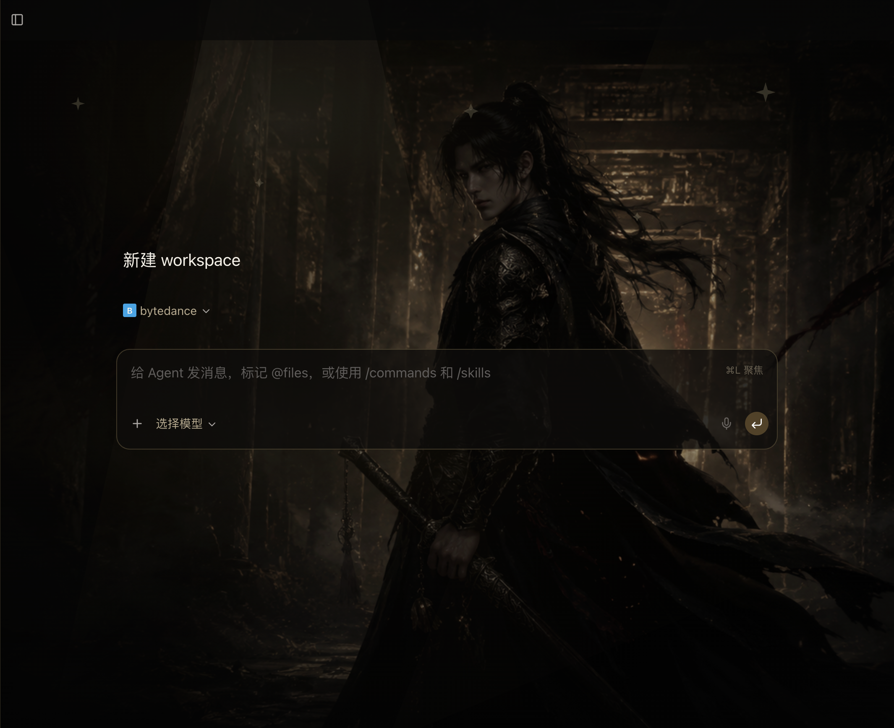

# Paseo Skins

一个面向 Paseo 的非官方皮肤画廊与本地加载器。网页负责主题预览、搜索和复制安装命令；CLI 负责安全下载声明式主题，并通过 `127.0.0.1` 上的 Chrome DevTools Protocol（CDP）只向 `paseo://app/` 渲染窗口注入样式。

默认主题是原创「暗夜江湖·黑金」。公开画廊同时提供「冷月青锋」「朱砂夜行」两个同源配色预设。首页完整展示主视觉，进入 workspace 后自动降低背景强度，避免影响代码与对话阅读。



## 特性

- 不 patch Paseo，不覆盖官方文件，Paseo 升级不会删除本仓库。
- CDP 固定绑定回环地址，并校验 WebSocket 仍指向指定端口的 page target。
- watcher 覆盖当前窗口、reload 和后续新窗口；停止时注销 reload hook。
- `pause` / `reset` 可恢复根节点、样式、overlay 和动态内联样式。
- `theme.json` 描述图片、焦点、路由强度和颜色；加载前校验路径、类型、大小及像素数。
- 支持通过 `--theme-url` 安装远程主题；只接受 HTTPS 同目录 JSON 与 PNG/JPEG，不执行远程脚本。
- `doctor` 提供只读环境诊断，`verify` 检查根节点可见性、overlay 安全和横向溢出。
- Node.js 原生实现，无运行时第三方依赖。

## 皮肤画廊

本地预览站点：

```bash
npm run site
```

打开 `http://127.0.0.1:4173` 即可浏览主题、搜索筛选、查看详情并复制安装命令。站点是纯静态 HTML/CSS/JS，可直接发布到 GitHub Pages；主题目录位于 `site/catalog.json`。

## 环境要求

- macOS
- `/Applications/Paseo.app`
- Node.js 22 或更高版本

## 快速开始

```bash
cd paseo-skin-loader
npm install
npm run doctor
npm start
```

如果 Paseo 尚未运行，`npm start` 会用官方可执行文件启动它，并只在 `127.0.0.1:9224` 开启 CDP。如果 Paseo 已经运行但没有 CDP，加载器会安全退出，不会替你强制重启或中断 agents；完成或 handoff 当前任务后，正常退出 Paseo再重试。

终端需要保持运行。按 `Ctrl+C` 会停止 watcher 并注销 reload hook，但当前窗口的主题会保留，直到执行 `pause` / `reset` 或关闭窗口。

从画廊安装远程主题时，命令形态如下：

```bash
npx --yes github:huangguang1999/paseo-skins start \
  --theme-url 'https://huangguang1999.github.io/paseo-skins/themes/stage-black-gold.theme.json'
```

## 常用命令

| 命令 | 作用 |
|---|---|
| `npm start` | 必要时启动 Paseo，并持续注入当前及新窗口 |
| `npm run inject -- --port 9224` | 连接已经启用 CDP 的 Paseo |
| `npm run status -- --port 9224` | 查看应用、CDP、renderer 和主题状态 |
| `npm run doctor -- --port 9224` | 只读检查环境、主题资源和可选实时连接 |
| `npm run verify -- --port 9224` | 验证根节点、主题生命周期和布局安全 |
| `npm run verify -- --port 9224 --screenshot /tmp/paseo-skin.jpg` | 验证并保存当前 renderer 截图；4K 窗口推荐 JPEG |
| `npm run pause -- --port 9224` | 移除当前主题，恢复官方渲染样式 |
| `npm run reset -- --port 9224` | 与 `pause` 相同，用于故障恢复 |
| `npm run check` | 运行语法检查和全部测试 |

一键恢复的推荐顺序：

```bash
# 先在 watcher 终端按 Ctrl+C
npm run reset -- --port 9224
```

`reset` 不退出 Paseo，也不重启 daemon。

## 自定义主题

复制 `assets/stage-black-gold.theme.json`，让图片和清单位于同一目录，再执行：

```bash
npm start -- --theme /absolute/path/to/my-theme.json
```

如需切回原黑金主题：

```bash
npm start -- --theme "$PWD/assets/stage-black-gold.theme.json"
```

远程主题可用 `doctor` 先检查：

```bash
npm run doctor -- --theme-url 'https://example.com/themes/my-theme.theme.json'
```

主题格式、字段范围和图片限制见 [主题格式](docs/THEME_FORMAT.md)。当前支持 PNG/JPEG，单图不超过 16 MB、单边不超过 16384 px、总像素不超过 5000 万。建议使用 16:9 横图，并让主体避开左侧导航区域。

## 工作原理

```text
PASEO_ELECTRON_FLAGS
        │
        ▼
127.0.0.1:9224 CDP ──► target 过滤与 WebSocket 校验
        │
        ▼
watcher ──► Page.addScriptToEvaluateOnNewDocument
        │
        ├──► 当前 renderer 立即注入
        └──► reload / 新窗口自动注入

Ctrl+C ──► 注销 reload hook
reset  ──► destroy observer + overlay + style + 动态内联样式
```

主要文件：

- `src/cli.mjs`：命令、诊断、验收和安全启动流程。
- `src/electron-launcher.mjs`：合并 localhost-only Electron flags。
- `src/cdp-client.mjs`：target 过滤、CDP 校验、watcher 生命周期和截图。
- `src/theme-loader.mjs`：主题清单与图片安全校验。
- `src/remote-theme.mjs`：HTTPS 下载、重定向约束、体积限制和本地缓存。
- `src/stage-black-gold-skin.mjs`：路由感知的视觉层和完整 destroy 生命周期。
- `site/`：静态皮肤商店、主题目录与公开原创资源。
- `assets/`：本地内置主题清单、原创图片和已注明来源的本地壁纸。

## 安全边界

CDP 对 renderer 拥有完整控制能力。绑定 `127.0.0.1` 可以避免局域网直接访问，但同一台电脑、同一用户权限下的其他本地进程仍可能连接该端口。只运行可信代码，用完可退出 Paseo；不要将端口转发到公网或局域网。

更多边界和报告方式见 [SECURITY.md](SECURITY.md)。

## 参考与许可证

项目的安全与生命周期设计参考了 [Codex Dream Skin](https://github.com/Fei-Away/Codex-Dream-Skin) 和 [codex-plusplus tweaks](https://github.com/b-nnett/codex-plusplus) 的公开做法，但没有复制 Paseo、Codex 或第三方主题代码。默认壁纸来源和权利说明见 [NOTICE.md](NOTICE.md)，具体工程对齐项见 [参考说明](docs/REFERENCE_NOTES.md)。

代码采用 [MIT License](LICENSE)。品牌与素材声明见 [NOTICE.md](NOTICE.md)。
